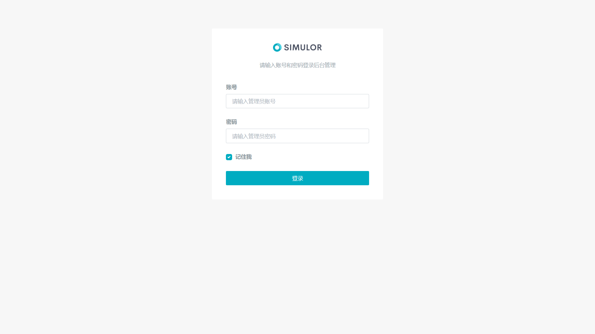
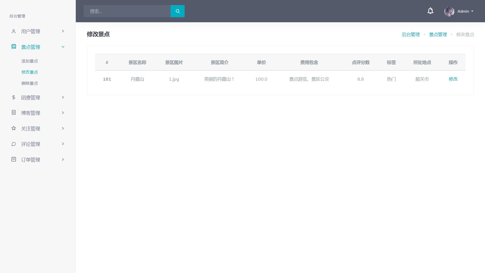
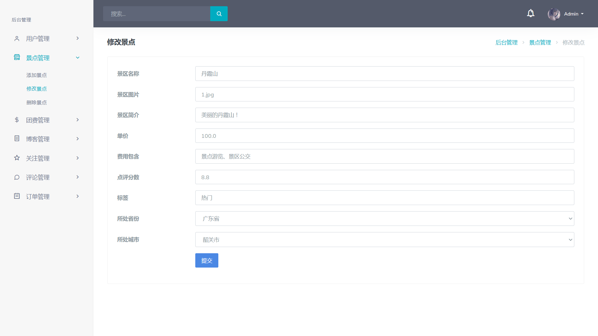
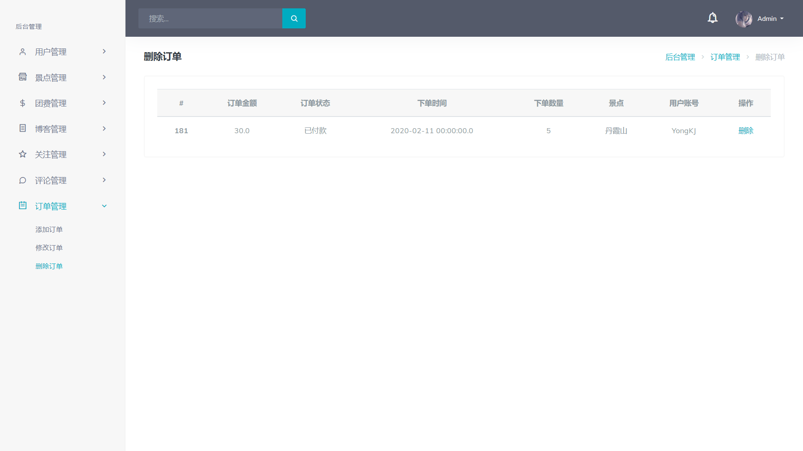

# 旅游信息管理系统

#### 介绍
本项目为学习与练习项目，通过分析旅游 APP 的需求，设计相应的实体类，并开发一个简单的信息管理系统便于管理旅游信息。主要功能包括管理员登录、用户管理、 景点管理、团费管理、博客管理、关注管理、评论管理、订单管理等。

#### 链接
旅游信息管理系统：[http://software.yongkj.cn/travel/](http://software.yongkj.cn/travel/)
> 账户：admin
> 密码：1314520

#### 截图

#### 技术栈
MySQL+Servlet+JDBC+JSP+HTML+CSS+JS+JQuery+Bootstrap4

1.  网站采用B/S即浏览器/服务器结构，同时也采用了MVC设计规范
2.  前端的页面展示运用了Boostrap4框架以及jQuery框架
3.  后端的数据处理采用Java Web中的Servlet容器技术完成
4.  使用 PreparedStatement 拼接条件查询语句防止 SQL 注入
5.  JSP 页面中的数据渲染主要采用 JSTL 标签完成
6.  后台的数据存储主要采用开源的Mariadb数据库来完成

#### 功能特性

1.  实现了用户 / 景点 / 团费 / 博客 / 关注 / 评论 / 订单信息的增加、修改、删除
2.  具有省份城市之间的二级联动选择功能

#### 使用说明

1.  travel.sql 为数据库备份文件
2.  可在 WEB-INF/src/dao/SQLUtil.java 文件中修改数据库连接信息
3.  所有逻辑代码均在 WEB-INF/src/service/ 文件夹下

> 此项目是在 Linux 环境下使用 Jupyter Lab 代码编辑器开发，因此可直接部署在 Tomcat 中的 webapps 文件夹下，并且需要手动输入命令编译项目代码文件（进入 WEB-INF/src 文件夹后输入 javac -d ../classes/ -cp ../../../../lib/*:../lib/*:controller/:service/:dao/:entity/ controller/CentralController.java）。
